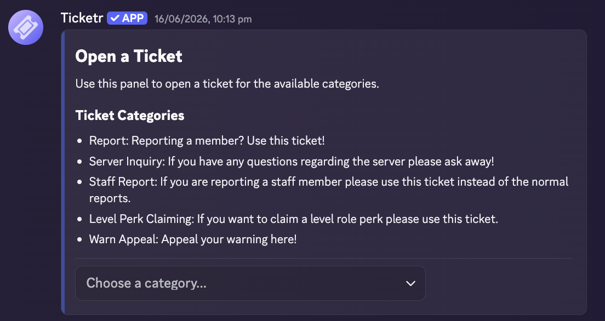
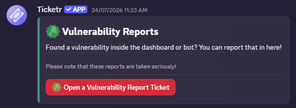

import { Activity, Box, Spade, Ticket, MessagesSquare } from "lucide-react";

## Panels

Ticket panels is the main way a user interacts with your ticket categories. You can have up to 2 panels in a free plan Discord Server.

> 
> Example of a published Ticket Panel

The quickest way to set up panels is via the dashboard as it lets you preview how the panel will look like and overall has better user experience than in Discord.

<Info>
	If you have a panel with a single category connected to it, you unlock the
	option to customize how the open ticket button looks.

    

</Info>

### Panel Settings

<ParamField body="Channel" type="Channel" required>
	Where to deploy the channel
</ParamField>

<ParamField body="Categories to Display" type="TicketCategories[]" required>
	Array of created ticket categories to connect and display on the panel.
	Having a single category connected to a panel will display a single button.

    <Warning>
    	You **must** have at least 1 category on a panel.
    </Warning>

</ParamField>

<ParamField body="Custom Message" type="Markdown">
	The message to display on the panel. Supports markdown!
</ParamField>

<ParamField body="Appearance Settings">
  General styling settings for your ticket panels.

  <Expandable title="Premium Customizations">
    <ParamField body="Panel Accent" type="HEX Colour" >
      <Badge color="violet" icon="sparkles">Plus & Professional</Badge>

      The HEX colour to display on the panel's side.
    </ParamField>

    <ParamField body="Ticket Welcome Accent" type="HEX Colour" >
      <Badge color="amber" icon="crown">Professional Only</Badge>

      The HEX colour to display on the ticket's welcome side.
    </ParamField>

  </Expandable>
</ParamField>

<ParamField body="Single Category Appearance Settings">
  General styling settings for your ticket panels.

  <Expandable title="Button Configuration" defaultOpen>
    <ParamField body="Button Colour" type="ButtonStyle" required>
      Set the style (colour) of the button that shows. You can only choose from Blurple, Grey, Green, and Red.
    </ParamField>

    <ParamField body="Custom Button Text" type="String">
      Sets the text on the button.
    </ParamField>

    <ParamField body="Custom Button Emoji" type="Emoji | Emoji Snowflake">
      Sets the emoji on the button. You can also use emojis from other servers with this bot added into it. Unicode emojis are also supported!
    </ParamField>

    <ParamField body="Hide Emoji" type="boolean">
      Hides the emoji on the button.
    </ParamField>

  </Expandable>
</ParamField>

---

## Categories

Categories are the backbone of your Ticketr setup. At least one category is required to build a panel.

### Category Setings

<ParamField body="Category Name" type="string" required>
	The display name shown on your ticket selection menu.
</ParamField>

<ParamField body="Category Emoji" type="Emoji | Emoji Snowflake">
	The emoji to add to the category. You are allowed to use emojis from other
	servers that Ticketr is in. Unicode emojis are also allowed.
</ParamField>

<ParamField body="Ticket Name Format" type="string" required>
	Custom template for channel/thread titles.   

    > See [Supported Variables in Ticket Name Format](#supported-variables-in-ticket-name-format)

</ParamField>

<ParamField
	body="Ticket Type"
	type="Channel | Thread"
	default="Thread"
	required
>
	Determines whether tickets open as private threads or standalone channels.
</ParamField>

<ParamField body="Age Restricted (NSFW)" type="boolean" default="false">
	When enabled, ticket channels will be marked as age-restricted. Per Discord's age groups, users who are labeled as teen or unknown will not be able to view this tickets.

    > Only available for Ticket Types that are set to Channel. To use with threads, you must have the parent channel set as age-restricted.

</ParamField>

<ParamField
	body="Max User Active Tickets"
	type="number"
	default="0 (infinite)"
	required
>
	Maximum concurrent open tickets a single member can have in this category.
</ParamField>

<ParamField body="Ping Managers" type="boolean" default="false" required>
	Whether to mention members with a specified Manager Role when a ticket is
	created.
</ParamField>

<ParamField body="Ping Roles" type="Role[]" required>
	Specific Discord roles pinged upon ticket creation. These roles will be able
	to view said ticket.
</ParamField>

<ParamField body="Restricted Roles" type="Role[]">
	Roles explicitly blocked from opening tickets in this category.
</ParamField>

<ParamField body="Manager Roles" type="Role[]" required>
	Roles granted permissions to answer and manage tickets in this category.
</ParamField>

<ParamField body="Welcome Message" type="Embed | Text">
	The greeting message posted inside the ticket immediately after creation.
</ParamField>

<ParamField body="Toggle Description Field" type="boolean" default="true">
	Enables or disables the default open-ended description input.
</ParamField>

<ParamField body="Custom Modal Components" type="ModalField[]">
	Modal components prompted before the ticket opens. You can only have a
	maximum of 5 per Discord's limitation. The default description component is
	counted as 1 of the 5 components. This can be disabled.

    > It is recommended that you see [Modal Components](modalcomponents)

</ParamField>

### Supported Variables in Ticket Name Format

Ticket Name Format supports different variables since v1.0. It is recommended that you build a ticket name like "si-foreverably" instead of relying on all 3 variables.

<ParamField body="{ticketname}">The name of the ticket category.</ParamField>

<ParamField body="{username}">
	The username of the person that opened the ticket.
</ParamField>

<ParamField body="{ticketnumber}">\# of the ticket that was opened.</ParamField>
